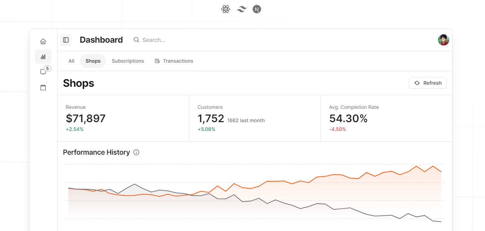

<h2 align="center">Chalk UI</h2>

<h4 align="center">Opinionated and flexible React components, styled with TailwindCSS, built for Next.js SaaS applications.</h4>

## Documentation

[Read the docs](https://chalk.rahim.app/).

## Credits

Chalk UI is inspired by the following projects:

- [shadcn/ui](https://ui.shadcn.com/)
- [Tremor](https://tremor.so/)
- [Saas UI](https://saas-ui.dev/)

### Resources

- [RadixUI](https://radix-ui.com/)
- [TailwindCSS](https://tailwindcss.com/)
- [Lucide Icons](https://lucide.dev/)
- [Zag.js](https://zagjs.com/)
- [zod](https://zod.dev/)
- [React Hook Form](https://react-hook-form.com/)
- [react-phone-number-input](https://www.npmjs.com/package/react-phone-number-input)
- [react-currency-input-field](https://www.npmjs.com/package/react-currency-input-field)
- [react-dropzone](https://react-dropzone.js.org/)
- [react-day-picker](https://react-day-picker.js.org/)
- [class-variance-authority](https://cva.style/docs)
- [tailwind-merge](https://github.com/dcastil/tailwind-merge)
- [tailwindcss-animate](https://github.com/jamiebuilds/tailwindcss-animate)
- And many more...

## License

This project is licensed under the MIT License - see the [LICENSE](https://github.com/5rahim/chalk-ui/blob/main/LICENSE) file for details.
